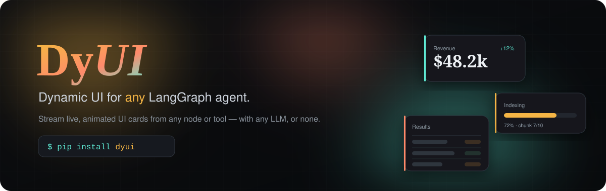
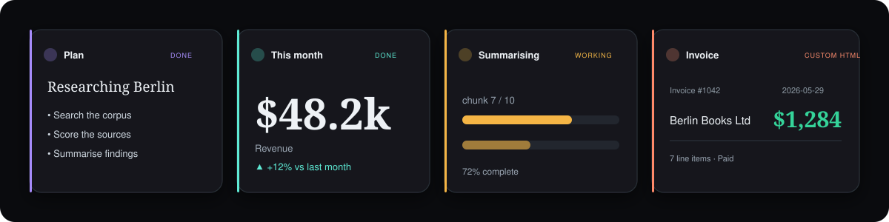
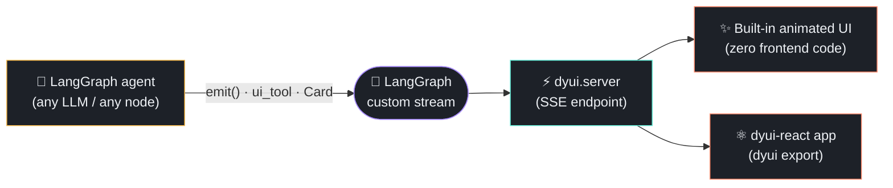
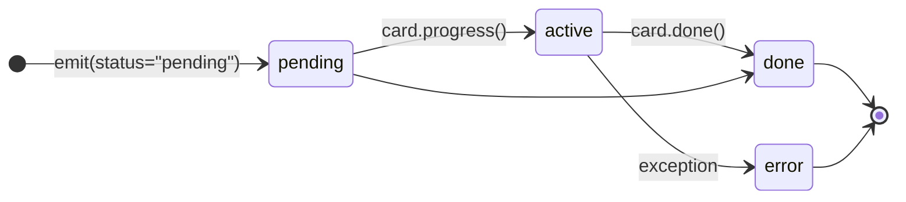

<div align="center">



<br/>

[](https://pypi.org/project/dyui/)
[](https://www.npmjs.com/package/dyui-react)
[](https://pypi.org/project/dyui/)
[](https://pypi.org/project/dyui/)
[](LICENSE)
[](https://langchain-ai.github.io/langgraph/)

### Stream beautiful, live UI **cards** from any LangGraph agent — with any LLM, or none.

From *one Python file* to an animated generative-UI chat app, **without writing any frontend code.**

<br/>

```bash
pip install "dyui[server]"
```

**[Install](#-install) · [Quickstart](#-quickstart) · [Zero-frontend UI](#-zero-frontend-bring-your-own-html) · [CLI](#%EF%B8%8F-cli) · [React](#%EF%B8%8F-the-react-runtime--dyui-react) · [PyPI ↗](https://pypi.org/project/dyui/) · [npm ↗](https://www.npmjs.com/package/dyui-react)**

</div>

<br/>

<div align="center">

<sub><i>The same agent event stream, rendered as animated cards — built-in components and your own HTML.</i></sub>
</div>

---

## ✨ Why DyUI

LLM agents do interesting work — but `print()` and plain text throw most of it away. **DyUI lets the agent say *what to render*** — a table, a stat, a progress bar, your own HTML — and streams those instructions to a frontend that animates them into a chat.

It rides LangGraph's native `custom` stream channel, so it works with **any model and any graph**. No voice, no vendor lock-in, no glue code.

```python
from dyui import emit

emit("stat", {"label": "Revenue", "value": "$48.2k", "delta": "+12%"},
     title="This month", accent="emerald")
```

<table>
<tr>
<td width="33%" valign="top">

### 🧩 Plug into any agent
One line in any node or tool. Works with OpenAI, Anthropic, Groq, local models — or no LLM at all.

</td>
<td width="33%" valign="top">

### 🎨 Zero frontend code
Ships a polished, animated chat UI. Run one command, open the browser. Bring your own HTML cards.

</td>
<td width="33%" valign="top">

### 🤖 AI-assisted setup
`dyui claude init agent.py` hands your code to a coding agent that designs custom cards for you.

</td>
</tr>
</table>

---

## 📦 Install

> **Which do I need?** The **Python package (`pip`) is always required** — it runs your
> agent and ships the built-in UI. The **npm package is optional** — add it *only* if you're
> building your own React frontend.

```bash
pip install "dyui[server]"     # ✅ required — the agent side + built-in served UI (pip)
npm install dyui-react         # ⚛️ optional — only to embed cards in your own React app (npm)
```

| Your goal | What to install | Package |
|---|---|---|
| A working dynamic-UI app straight from Python, **zero frontend code** (`dyui serve`) | `pip install "dyui[server]"` | [`dyui`](https://pypi.org/project/dyui/) (PyPI) |
| Embed the cards in **your own React / Next.js app** with custom components | `pip install dyui` **+** `npm install dyui-react` | [`dyui`](https://pypi.org/project/dyui/) + [`dyui-react`](https://www.npmjs.com/package/dyui-react) (npm) |

---

## 🚀 Quickstart

**1 — Emit cards** from any node or tool:

```python
from dyui import emit, ui_tool, Card

# imperative
emit("table", {"columns": ["city", "temp"], "rows": [["Berlin", 21]]}, title="Weather")

# decorator: auto "pending → done/error" around a tool
@ui_tool("stat", title="Sum", icon="calculator", accent="emerald")
def add(a, b): return {"label": f"{a}+{b}", "value": a + b}

# context manager: long work, one card updated in place
with Card("progress", title="Indexing") as card:
    for i in range(1, 4): card.progress({"value": i, "max": 3})
    card.done({"value": 3, "max": 3, "label": "Done"})
```

**2 — Expose it** (one line):

```python
from dyui.server import create_dyui_app
app = create_dyui_app(graph)        # graph = your compiled LangGraph
```

**3 — Run it:**

```bash
dyui serve agent.py                 # or: uvicorn agent:app
```

Open the browser → an animated chat that renders your cards live, with a “thinking” indicator while the agent works.

---

## 🖥️ Zero-frontend: bring your own HTML

No React, no npm. Drop `.html` files in a folder and emit them by name — `{{ key }}` is escaped, `{{{ key }}}` is raw:

```python
from dyui import HtmlTemplates
cards = HtmlTemplates("cards")      # ./cards/invoice.html, ...

cards.emit("invoice", {"number": 42, "total": "$1,200"}, title="Invoice", accent="emerald")
```

The bundled UI renders it instantly. That's the whole *“one Python file + HTML templates → dynamic UI”* path.

---

## 🃏 Built-in cards

| component | props | | component | props |
|---|---|---|---|---|
| `text` | `{text}` | | `list` | `{items}` |
| `markdown` | `{text}` | | `keyvalue` | `{data}` |
| `table` | `{columns, rows}` | | `json` | any |
| `stat` | `{label, value, unit?, delta?}` | | `alert` | `{text, level?, title?}` |
| `progress` | `{value, max?, label?}` | | `image` | `{src, alt?, caption?}` |
| `html` | `{html}` *(fully custom — sanitized, see below)* | | | |

> **Security — `html` cards.** Both runtimes pass `html`-card markup through a
> parser-based, allowlist sanitizer (known-safe tags/attributes only; event
> handlers and `javascript:`/`data:` URLs are stripped). It is a sane default,
> **not** a hardened security boundary. For hostile/untrusted input (e.g. raw
> tool output or LLM text that an attacker can influence), override the `html`
> card with a [DOMPurify](https://github.com/cure53/DOMPurify)-backed component
> in `dyui-react`. Raw template placeholders (`{{{ key }}}` / `{{& key }}`)
> inject **unescaped** — only pass pre-trusted HTML there.
>
> The `dyui serve` / `create_dyui_app` server is a **development** convenience:
> CORS defaults to localhost-only, and you can require a bearer token with
> `create_dyui_app(graph, api_token="…")`. Put it behind real auth before
> exposing it beyond your machine.

---

## 🛠️ CLI

`pip install dyui` installs the `dyui` command:

| Command | What it does |
|---|---|
| `dyui claude init agent.py` | Hand your agent file to **Claude Code** — it reads your graph, proposes a card plan, **asks you to confirm**, then builds + wires the cards. |
| `dyui gemini init agent.py` | Same, via the **Gemini CLI**. |
| `dyui codex init agent.py` | Same, via the **Codex CLI**. |
| `dyui serve [target]` | Run the served dynamic UI (auto-discovers `app`/`graph`). |
| `dyui export <name>` | Eject the whole UI as an editable **Vite + React** project. |

---

## 🔭 How it works



Each card is **one event**: a `component` key (which card), `props` (the data), a lifecycle `status`, and an optional `id` to update it in place. The Python `UIEvent` model and the TypeScript `DyUIEvent` type are identical, so the wire format never drifts.



---

## ⚛️ The React runtime — [`dyui-react`](https://www.npmjs.com/package/dyui-react)

DyUI gives you **two ways to render** the exact same agent event stream:

| | Use it when |
|---|---|
| **Built-in served UI** (`dyui serve`) | You want a polished result *now* with zero frontend code — demos, internal tools, prototypes, or shipping a chat app straight from Python. Customise with HTML cards. |
| **`dyui-react`** (npm) | You're embedding the cards in your **own React/Next.js app**, need **bespoke React card components**, or want full control over layout, routing, and styling. |

```bash
npm install dyui-react
```

```tsx
import { useDyUIAgent, DyUISurface, createRegistry } from "dyui-react";
import "dyui-react/styles.css";

// A custom React card for events your agent emits as `emit("my_card", {...})`.
function MyCard({ props }) {
  return <div>{props.title}</div>;
}

export default function App() {
  // Register custom cards by key; built-ins (table, stat, progress, …) stay available.
  const registry = createRegistry({ my_card: MyCard });

  // Connect to your running `dyui serve` (or any create_dyui_app) endpoint.
  const { cards, tokens, status, run, dismiss } = useDyUIAgent({ url: "/dyui/stream" });

  return (
    <>
      <button onClick={() => run("hello")}>Ask</button>
      <DyUISurface cards={cards} registry={registry} onDismiss={dismiss} />
      <pre>{tokens}</pre>
    </>
  );
}
```

**What you get:** `useDyUIAgent` (connects to the SSE endpoint, manages live card
state + streamed tokens), `<DyUISurface>` / `<DyUICard>` (renderers with built-in
lifecycle skeletons), `createRegistry` (custom + built-in cards), and a low-level
`streamAgent` client. Zero runtime deps, themeable via CSS variables.

> 💡 `dyui export <name>` scaffolds a complete `dyui-react` app for you — pre-wired
> to your agent, ready to `npm install && npm run dev`.

---

## 🗂️ Repository layout

```
dyui/
├─ python/        # the `dyui` pip package
│  ├─ dyui/       #   emit · server · cli · scaffold · html templates + the served UI
│  ├─ examples/   #   runnable agents (search demo, HTML-templates demo)
│  └─ tests/      #   pytest suite
└─ react/         # the `dyui-react` npm package (hook · surface · card registry)
```

---

## 🧪 Development

```bash
# Python
cd python && python -m venv .venv && . .venv/Scripts/activate    # Windows
pip install -e ".[dev]" && pytest

# React
cd react && npm install && npm run build && npm test
```

---

<div align="center">

**MIT Licensed** · Built with ❤️ for the LangGraph community

<sub>If DyUI makes your agents prettier, consider giving it a ⭐</sub>

</div>
